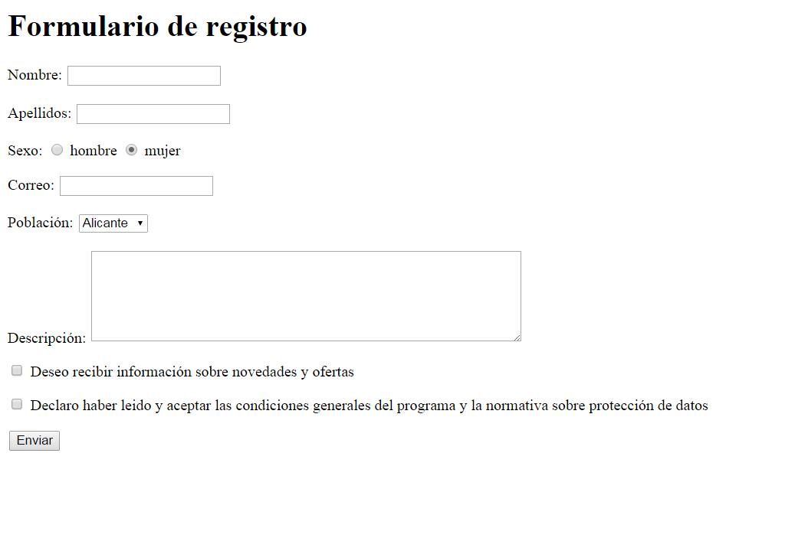

## Enunciado
Al formulario anterior le tienes que añadir los siguientes campos de información:

*   Población, una lista desplegable con las opciones Alicante, Madrid, Sevilla y Valencia.
*   Descripción, un área de texto multilínea.
*   Además, tienes que asociar la etiqueta de cada control a su control para mejorar la usabilidad y la accesibilidad.

Debes crear una página web que tenga el mismo aspecto que la siguiente imagen:

