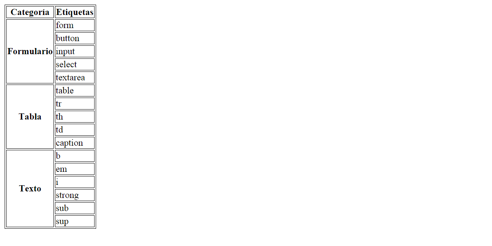

## Enunciado
Debes crear una página web que tenga el mismo aspecto que la siguiente imagen:




Código base

````
<!DOCTYPE html>
<html>
  <head>
    <title>Tabla compleja</title>
    <style>
      table, tr, th, td {
        border: 1px solid black;
      }
    </style>
  </head>
  <body>
    Categoría	Etiquetas

    Formulario
    form
    button
    input
    select
    textarea

    Tabla
    table
    tr
    th
    td
    caption

    Texto
    b
    em
    i
    strong
    sub
    sup
  </body>
</html>
````
